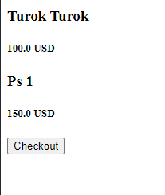
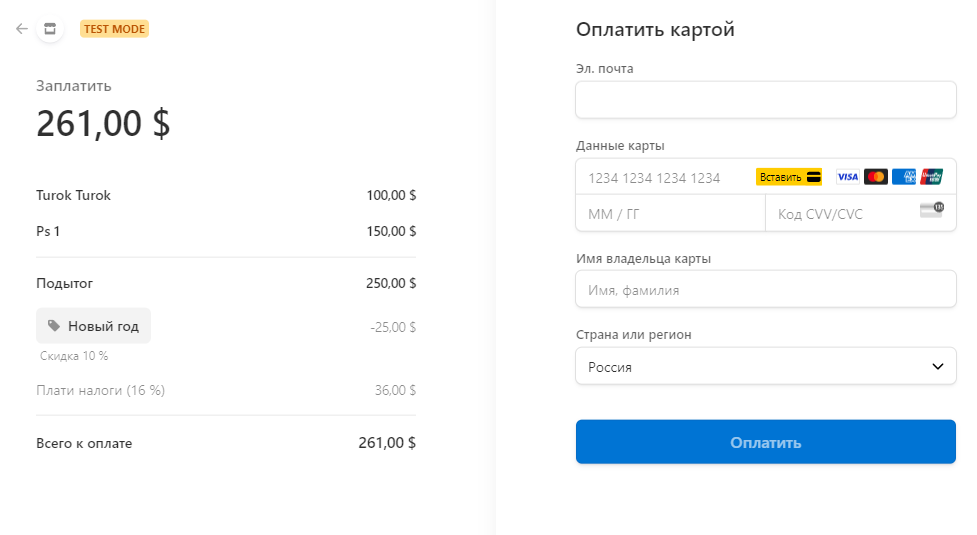

# Оплата с помощью Stripe
Этот проект предоставляет API для оплаты товаров и групп товаров (Order) через сервис Stripe. 
Реализована административная панель Django для управления товарами, скидками и налогами.

## Модели данных
Item

- Модель товара содержит информацию о товаре, его описании, цене и валюте.

Order

- Модель группы товаров, состоящих из нескольких позиций Item. Позволяет оформить заказ для нескольких товаров сразу.

Discount

- Модель скидочных купонов, создаваемых через административную панель. Для применения скидок к Order.

Tax

- Модель видов налогов, которые могут применяться к Item.

## Использование API
Эндпоинты:
- /buy/<id> - получение Stripe Session ID для оплаты выбранного Item.
- /item/<id> - получение информации о товаре с кнопкой перехода к оплате Stripe.
- /buy_order/<id> - получение Stripe Session ID для оплаты выбранного Order (группы Item).
- /order/<id> - получение информации о заказе с кнопкой перехода к оплате Stripe.

## Установка и запуск:

1. Клонируйте репозиторий:

`git clone https://github.com/lllrikitikilll/stripe_payment_with_docker.git`
2. Перейдите в папку проекта:

`cd stripe_payment_with_docker`

3. Занесите ключи Stripe в файл .env в корневой папке проекта:
```
STRIPE_PUBLIC_KEY='your_key'
STRIPE_SECRET_KEY='your_key'
```

4. Соберите образ и запустите контейнер Docker:
```dockerfile
docker build -t pay .
docker run -p 8000:8000 --name pay_con --rm pay
```
5. После успешного запуска контейнера, приложение будет доступно по адресу:

`http://127.0.0.1:8000/`


При создании образа Docker, в базе данных SQLite будет создан пользователь root со следующими учетными данными:

```
username: root
password: root
```
## Пример оплаты Order


`http://127.0.0.1:8000/order/1/`






